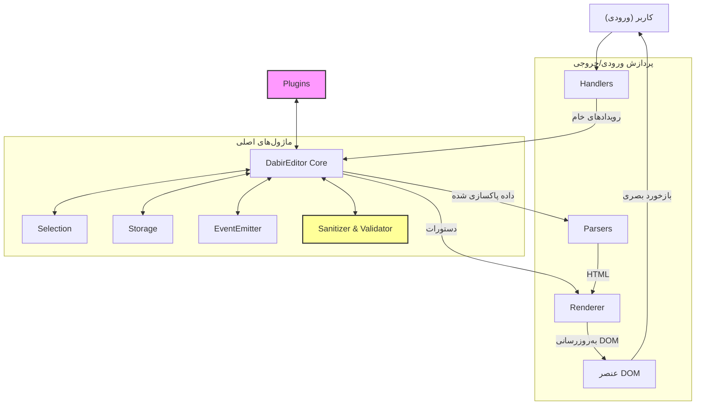

# نمای کلی معماری

این مستند، معماری داخلی ویرایشگر «دبیر» را شرح می‌دهد تا به توسعه‌دهندگان درک عمیق‌تری از نحوه کارکرد آن بدهد.

## نمودار معماری

معماری «دبیر» به صورت ماژولار طراحی شده است تا هر بخش مسئولیت مشخصی داشته باشد و قابلیت گسترش‌پذیری بالایی فراهم شود. لایه‌های امنیتی و اعتبارسنجی نیز برای اطمینان از پایداری اضافه شده‌اند.

## توضیح ماژول‌ها

### ۱. هسته (`Core`)

این بخش، قلب ویرایشگر است و وظیفه هماهنگی بین تمام ماژول‌های دیگر را بر عهده دارد.

-   **`DabirEditor`**: کلاس اصلی که تمام ماژول‌ها را راه‌اندازی و مدیریت می‌کند. شامل لایه اعتبارسنجی ورودی‌ها (Input Validation) در سازنده است.
-   **`EventEmitter`**: سیستم مدیریت رویدادها که اکنون دارای مکانیزم مدیریت خطا (Try-Catch) است تا خرابی یک شنونده باعث توقف کل سیستم نشود.
-   **`Selection`**: ابزارهایی برای کار با انتخاب متن (Selection) و محدوده (Range) کاربر در ویرایشگر فراهم می‌کند.
-   **`Storage`**: مسئول ذخیره و بازیابی محتوای ویرایشگر در `localStorage` است و خطاهای دسترسی به حافظه را به صورت امن مدیریت می‌کند.

### ۲. ابزارها و امنیت

-   **`Sanitizer`**: یک ماژول امنیتی که تمام ورودی‌های HTML (از طریق پیست، بارگذاری یا `setContent`) را بررسی کرده و کدهای مخرب (XSS) را حذف می‌کند.
-   **`Validator`**: منطقی که در سازنده کلاس اصلی قرار دارد و تضمین می‌کند ورودی‌های کاربر (مانند Selector و Options) معتبر هستند.

### ۳. مدیریت‌کننده‌ها (`Handlers`)

این ماژول‌ها به رویدادهای خام مرورگر گوش داده و آن‌ها را به عملیات معنی‌دار برای ویرایشگر تبدیل می‌کنند. تمام هندلرها دارای متد `destroy` برای پاکسازی حافظه هستند.

-   **`KeyboardHandler`**: رویدادهای کیبورد را مدیریت می‌کند، مسئول پردازش زنده مارک‌داون در حین تایپ و اجرای میانبرهاست.
-   **`MouseHandler`**: رویدادهای ماوس و تغییرات انتخاب متن را مدیریت می‌کند. شامل مکانیزم‌های جلوگیری از Race Condition است.
-   **`ClipboardHandler`**: عملیات کپی و پیست را مدیریت می‌کند.
-   **`InputHandler`**: به رویداد عمومی `input` گوش می‌دهد و مسئول اصلی ذخیره‌سازی خودکار محتواست.

### ۴. پارسرها (`Parsers`)

این ماژول‌ها وظیفه تبدیل داده از یک فرمت به فرمت دیگر را بر عهده دارند و با لایه‌های «محافظت از خطا» (Error Boundary) پوشانده شده‌اند.

-   **`MarkdownParser`**: رشته مارک‌داون را به رشته HTML تبدیل می‌کند.
-   **`HtmlParser`**: محتوای HTML ویرایشگر را به مارک‌داون خالص تبدیل می‌کند.
-   **`LiveParser`**: برای پردازش سریع و زنده مارک‌داون در حین تایپ کاربر استفاده می‌شود.
-   **`InlineParser`**: مسئول پردازش قالب‌بندی‌های درون‌خطی مانند `**پررنگ**` و `*کج*` است.

### ۵. رندرکننده (`Renderer`)

-   **`Renderer`**: یک ماژول ساده برای انجام تغییرات در DOM به صورت ایمن.

### ۶. پلاگین‌ها (`Plugins`)

پلاگین‌ها به ویرایشگر اجازه می‌دهند تا قابلیت‌های جدیدی را بدون تغییر هسته اصلی به دست آورد. نصب و اجرای پلاگین‌ها در بلاک‌های `try-catch` قرار گرفته تا باگ در یک پلاگین شخص ثالث، ویرایشگر را از کار نیندازد.

## جریان داده (Data Flow)

یک چرخه معمولی در ویرایشگر به صورت زیر است:

1.  **ورودی کاربر**: کاربر یک کلید را فشار می‌دهد.
2.  **Handler**: هندلر مربوطه رویداد را دریافت کرده و بررسی می‌کند که آیا ویرایشگر فعال (Destroy نشده) است یا خیر.
3.  **Core/Sanitizer**: اگر ورودی محتوا باشد، از فیلتر امنیتی عبور می‌کند.
4.  **Parser**: محتوا پردازش می‌شود (با مدیریت خطا).
5.  **Renderer**: تغییرات در DOM اعمال می‌شود.
6.  **Event Emitter**: رویداد تغییر منتشر می‌شود.

## سیستم پلاگین (Plugin System)

سیستم پلاگین به صورت متمرکز توسط کلاس `DabirEditor` مدیریت می‌شود. در زمان راه‌اندازی، ویرایشگر متد استاتیک `install` هر پلاگین را فراخوانی کرده و نمونه ویرایشگر را به آن پاس می‌دهد. پلاگین‌ها همچنین متد `destroy` را برای پاکسازی منابع پیاده‌سازی می‌کنند.
